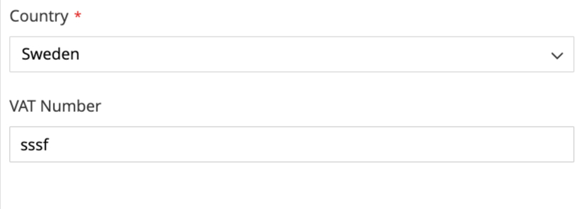
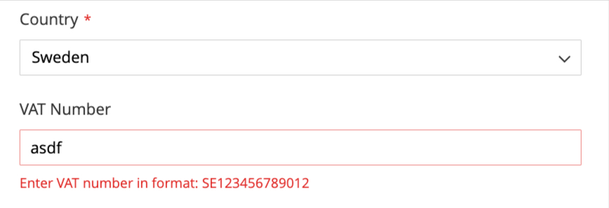

# 🧾 Magento 2 VAT ID Validation

A lightweight module that adds client-side **VAT ID validation** to key Magento 2 forms like checkout and customer address forms.
This is helpful for EU country based commerce, that needs to verify VAT ID via VIES.

---

## 📋 Description

Magento 2 by default allows invalid or incorrectly formatted VAT IDs during checkout, which can lead to customer entry errors and issues with tax/VAT compliance like VIES check.

This module adds **smart VAT ID validation per country**, using patterns based on the official EU formats.

<table>
  <tr>
    <td><strong>Default Magento 2 behavior:</strong><br></td>
    <td><strong>With this module enabled:</strong><br></td>
  </tr>
</table>

### ✅ Features
- Validates VAT ID format based on the selected country
- Works on:
  - 🛒 Checkout (shipping & billing addresses)
- Translation-ready (`i18n/sk_SK.csv` and `%1` placeholders supported)
- Fully frontend (JS-based) — no backend override

---

## 📦 Installation

### Option 1: Composer (Recommended)

```bash
composer require matusstafura/magento2-vatid-validation
````

### Option 2: Manual Installation (for testing or customization)

```bash
git clone https://github.com/matusstafura/magento2-vatid-validation.git app/code/MatusStafura/VatIdValidation
```

Then run:

```bash
bin/magento module:enable MatusStafura_VatIdValidation
bin/magento setup:upgrade
bin/magento setup:di:compile
bin/magento cache:flush
```

## 🚀 TODO

* ⏳ Option to override per store (via admin config)

---

## 🤝 Contributing

Contributions are welcome!

1. Fork the repo
2. Create a new branch:

```bash
git checkout -b feature/your-feature-name
```

3. Make your changes
4. Push to your fork:

```bash
git push origin feature/your-feature-name
```

5. Open a pull request

---

## 📃 License

MIT

---

## ☕ Support

If you find this module helpful:

[](https://www.buymeacoffee.com/matusstafura)

